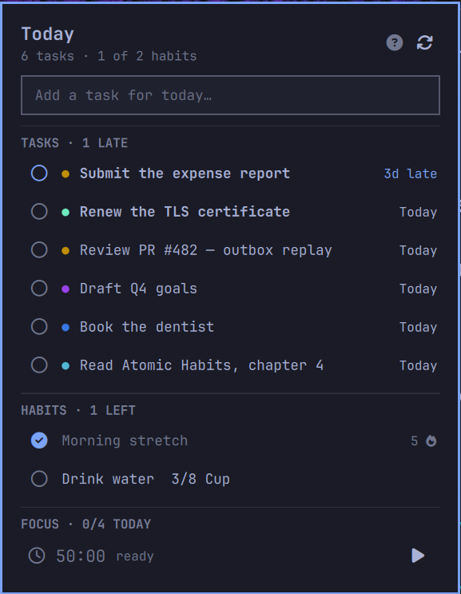

# TickTick for Omarchy

**What's due and what you haven't done yet, in the Omarchy bar.** Tasks and
habits in one popup, with the two actions that belong on a bar: tick a task
off, check a habit in.



The bar shows a count (` 3  2♦` — three tasks due, two habits open) and
turns urgent when something is late. Left click opens the panel.

## Features

- Tasks due today, tomorrow, or the next seven days, overdue ones first
- Completing a task or checking a habit in is a click on its circle — the
  row itself is not a hit target, so a stray click costs nothing
- Habits with today's state and a running streak
- Quantified habits (8 cups of water) advance one step per click
- Quick-add field — type a title, hit enter, it lands due today
- **Undo window** — a completion or check-in is held for a few seconds before
  it is sent, so a misclick costs nothing
- **Focus timer** — a pomodoro that uses your TickTick durations, counts down
  in the bar, and uploads each finished block to your focus statistics
- Fully keyboard driven, with an in-panel shortcut list
- Tag colours come straight from TickTick; due state follows your Omarchy theme
- Everything is theme aware and follows the bar's vertical/horizontal layout

## Requirements

| Dependency | Required | Why |
|---|---|---|
| Omarchy 4 (Quattro) with Quickshell | yes | the shell that hosts the plugin |
| `python3` | yes | the CLI; standard library only, no pip packages |
| `curl` | no | not used — the CLI speaks HTTP through `urllib` |
| `secret-tool` (libsecret) | no | only for the optional `--save-password` path |
| A TickTick account | yes | free accounts work; habits need TickTick's own habit feature |

No external Python packages, no build step, and nothing is compiled.

## Install

```bash
omarchy plugin add https://github.com/<you>/omarchy-ticktick.git --enable
```

Then click the widget in the bar. It shows a plug icon until it is
connected, and clicking it opens a setup card with three steps and a paste
field:

1. Open `ticktick.com` and sign in
2. `F12` → **Application** → **Cookies** → `https://ticktick.com`
3. Copy the value of the cookie named **`t`**, paste it, press Connect

That is the whole setup. The field is masked, the token is handed to the CLI
through a file in a `0700` directory rather than on a command line, and the
file is deleted as soon as it is read. Nothing reads your browser.

Why a cookie and not a password: see [About the API](#about-the-api). Short
version — TickTick's risk control rejects scripted password logins, so the
browser session is the reliable path.

If you would rather stay in a terminal:

```bash
~/.config/omarchy/plugins/io.github.sotoaugusto.ticktick/bin/omarchy-ticktick login --token -
```

`--token -` prompts with the input hidden, so the credential stays out of
your shell history.

When the token eventually expires, the panel returns to the same card and
says so. Reconnecting is the same paste.

## Removal

```bash
omarchy plugin remove io.github.sotoaugusto.ticktick
```

That disables the widget, drops its entry from `~/.config/omarchy/shell.json`,
and deletes the plugin directory. Two things live outside it and are left
behind on purpose, because they are your data and your credential:

```bash
omarchy-ticktick logout                     # forget the token + keyring entry
rm -rf ~/.local/state/omarchy/ticktick      # remove the cache and session file
```

Run `logout` **before** removing the plugin if you want the keyring entry
cleared too — the CLI is what knows how to clear it, and removal deletes the
CLI. Nothing in TickTick itself is touched: no tasks, habits, or focus
sessions are deleted by uninstalling.

## About the API

TickTick's documented Open API (v1, OAuth) has **no habits endpoint at all**.
It covers projects and tasks and nothing else. This plugin therefore speaks
the same private v2 API the TickTick web app uses, authenticated with a
session token.

That is a deliberate trade and you should know what you are taking on:

- It is undocumented. TickTick can change or break it without notice.
- Scripted password login is unreliable and risky. `/api/v2/user/signon`
  answers a *correct* password with `username_password_not_match` when its
  risk control does not recognise the client, and repeated attempts get the
  account flagged. Use the browser token.
- The edge rejects requests that imitate the web app too closely. Sending
  `Origin`/`Referer`, or the full `x-device` object from TickTick's own
  bundle, returns `access_forbidden`; a minimal `x-device` is what works.
- No password is written to disk. Only the session token is, at
  `~/.local/state/omarchy/ticktick/session.json`, mode 0600.
- `/api/v2/user/signin` — the path several published wrappers still use — is
  a dead 404. The live one is `/user/signon`.

Sessions expire eventually. When one does, the panel says so and points at
the login command. If you would rather it recovered on its own:

```bash
omarchy-ticktick login --save-password    # needs secret-tool
```

That stores the password in your system keyring — not in a dotfile — and the
CLI re-authenticates by itself when a token stops working.

Using TickTick's Chinese service instead? Set `TICKTICK_DOMAIN=dida365.com`.

## How it fits together

The shell never talks to TickTick. `bin/omarchy-ticktick` owns the session
and every request, and writes a cache to
`~/.local/state/omarchy/ticktick/data.json`. `Panel.qml` watches that file
and shells back out for writes. So a long-lived credential stays out of the
shell process, and every mutation is one command you can run yourself.

```
bin/omarchy-ticktick   session, API calls, the JSON cache
Model.js               task filtering, due labels, habit streaks (node-testable)
Panel.qml              the popup, and the source of the bar's label
BarWidget.qml          the bar slot
```

### CLI

```bash
omarchy-ticktick login --token -            # paste the browser's `t` cookie
omarchy-ticktick login [--email ADDR] [--save-password]
omarchy-ticktick sync [--scope tasks|habits|pomo|full]
omarchy-ticktick add "Pay rent" --due today
omarchy-ticktick complete <taskId>
omarchy-ticktick reopen <taskId>
omarchy-ticktick delete <taskId>
omarchy-ticktick checkin "Read" --toggle    # by name or id
omarchy-ticktick checkin "Water" --value 3
omarchy-ticktick pomo status                # today's focus stats + settings
omarchy-ticktick pomo log --minutes 50      # upload a finished focus block
omarchy-ticktick status                     # cache state as JSON
omarchy-ticktick logout
```

Every command prints JSON on stdout and errors on stderr, so it scripts and
binds cleanly.

## Settings

Configure in Setup > Plugins, or inline on the bar entry in
`~/.config/omarchy/shell.json`:

| Key | Default | What it does |
|---|---|---|
| `refreshIntervalSec` | `300` | Background sync period. TickTick throttles; shorter buys nothing. |
| `horizon` | `Today` | `Today`, `Tomorrow`, or `Next 7 days`. |
| `includeOverdue` | `true` | Count and list work that is already late. |
| `showTasks` | `true` | Show the task section. |
| `showHabits` | `true` | Show the habit section. |
| `maxTasks` | `12` | Rows before the list is capped with a "+N more". |
| `barLabel` | `Count` | `Count`, `Next` (next task's title), or `Icon`. |
| `showPomo` | `true` | Focus section, and a live countdown in the bar. |
| `undoSeconds` | `6` | How long an action is held before sending. `0` disables undo. |
| `pomoMinutes` | `0` | Focus length. `0` follows your TickTick account. |
| `shortBreakMinutes` | `0` | Short break. `0` follows your account. |
| `longBreakMinutes` | `0` | Long break. `0` follows your account. |
| `longBreakInterval` | `0` | Long break every N blocks. `0` follows your account. |

```json
{
  "bar": {
    "layout": {
      "right": [
        { "id": "io.github.sotoaugusto.ticktick", "horizon": "Next 7 days", "maxTasks": 20 }
      ]
    }
  }
}
```

## Keys and clicks

| Where | Input | Action |
|---|---|---|
| Bar | left | open the panel |
| Bar | middle | sync now |
| Bar | right | open the TickTick web app |
| Panel | `↑` `↓` | move between tasks and habits |
| Panel | `enter` | complete the task / check the habit in |
| Panel | `u` | undo the held action |
| Panel | `a` | focus the quick-add field |
| Panel | `r` | sync now |
| Panel | `p` | start or pause focus |
| Panel | `d` / `del` | discard the focus block (not logged) |
| Panel | `g` / `G` | first / last row |
| Panel | `tab` | next bar panel |
| Panel | `?` | show or hide the shortcut list |
| Panel | `esc` | back out one layer, then close |

The shortcut list is reachable both ways: `?` from the keyboard, and the
**?** button in the panel header for the mouse. A shortcut list you can only
reach by shortcut helps the people who need it least.

IPC, for keybindings:

```bash
omarchy-shell io.github.sotoaugusto.ticktick toggle
omarchy-shell io.github.sotoaugusto.ticktick sync
```

## Tests

```bash
node --test tests/model.test.js
```

`Model.js` holds every piece of logic that can be wrong without being
visibly wrong — timezone handling on all-day due dates, streak counting
across a day that is still open, overdue sorting — so it is plain JS with no
QML imports and runs under node.

## Why writes feel immediate

A write costs a sync, and a full sync is five HTTP round trips — about two
seconds. Adding a task cannot change your habits, your check-ins, or your
pomodoro settings, so re-fetching them afterwards spends most of that second
confirming that nothing happened.

Syncs are therefore scoped. A task write refreshes tasks only, a check-in
refreshes habits only, and a finished focus block refreshes the pomodoro
stats. Sections outside the scope keep their cached values.

```bash
omarchy-ticktick sync --scope tasks     # ~0.6s, vs ~2.0s for full
```

On top of that, a quick-added task appears in the list the moment you press
enter, before the request completes. The next cache write replaces it with
the real one. The placeholder row is inert — it has no id yet, so it cannot
be completed by accident.

## Offline

A write made while TickTick is unreachable is not lost and not silently
dropped. It goes into an outbox at
`~/.local/state/omarchy/ticktick/outbox.json`, and the change is applied to
the local cache immediately — so the task appears in the list, the habit
shows checked, and both survive a shell restart rather than living only in
the panel's memory.

Every sync drains the queue before reading anything back, so what you get
afterwards reflects your writes instead of contradicting them. The panel
shows a cloud and a count while anything is waiting; clicking it retries.

This is safe to replay because **every write carries a client-generated id** —
tasks, check-in entries, and pomodoro records alike. Sending a queued write
twice updates the same record instead of creating a duplicate.

Replays resolve against current server state rather than being sent verbatim.
A v2 update is a whole-object write, so a queued completion re-fetches the
task and changes only its status; anything you edited on another device in
the meantime survives. Queued check-ins re-query the day's entry before
deciding whether to add or update it.

A write that TickTick actively *rejects* is dropped rather than retried
forever, since replaying a rejection only earns another rejection. A write
that never got a verdict — no network, or a rate limit — is kept and retried.
When the queue stalls, the remaining entries stay in order instead of each
one hammering a dead network.

```bash
omarchy-ticktick status     # includes the queued count
```

## Colours

TickTick stores a colour for **tags** and for **projects**, and this shows the
tag colour as a dot beside the task title. That is the only colour in a task's
data — there is no colour field on a task itself.

Overdue, today, and upcoming have **no colour in the API**. Every TickTick
client paints that itself, so this one paints it from your Omarchy theme
rather than hardcoding their palette: overdue takes the accent colour, today
takes normal foreground, anything further out is muted. A fixed red would
fight every theme you switch to.

Priority is the same story — the API gives an integer, not a colour — so a
high-priority task is shown in bold rather than in TickTick's red.

Note that dots only appear on tasks that are both tagged **and** dated, since
the panel lists dated tasks.

## Undo, and why it is a delay

Completing a task or checking a habit in does not fire immediately. The
action is held for `undoSeconds`, an undo row appears, and only when the
window lapses is anything sent. Closing the panel sends it right away —
closing is not a cancel.

It works this way because the alternative does not work. Completing a
*recurring* task rolls it forward to its next occurrence, and a later
`reopen` does not put that back; you get a different task in a different
state. An undo that never sends the request is the only one that is
actually reversible.

## Focus timer

TickTick's pomodoro is client-side. There is no server-side running clock to
join, so this plugin runs its own and uploads each completed block through
`POST /batch/pomodoro` — the same thing TickTick's apps do. Your durations,
break lengths, long-break interval, and daily goal are read from the account
(`/user/preferences/pomodoro`), so the rhythm matches the phone app.

Durations are settable per widget. Each of `pomoMinutes`,
`shortBreakMinutes`, `longBreakMinutes`, and `longBreakInterval` defaults to
`0`, meaning "use whatever TickTick says" — so the panel tracks your account
until you deliberately disagree with it, and only the fields you set are
overridden:

```json
{ "id": "io.github.sotoaugusto.ticktick", "pomoMinutes": 25, "longBreakInterval": 3 }
```

While a block runs the bar shows the countdown instead of the task count.
Stopping a block early does **not** log it: TickTick counts a pomodoro on
completion, and banking partial blocks would inflate the statistics this is
meant to keep honest.

## Limitations

- Read plus the core writes. No editing titles, no rescheduling, no
  subtasks, no moving between projects — do those in TickTick.
- Habit check-ins are all-or-step. Arbitrary values need `--value`.
- One account.
- The focus timer lives in the shell process. Restarting the shell loses a
  running block; it is not persisted.
- A stopped focus block is discarded, never logged.
